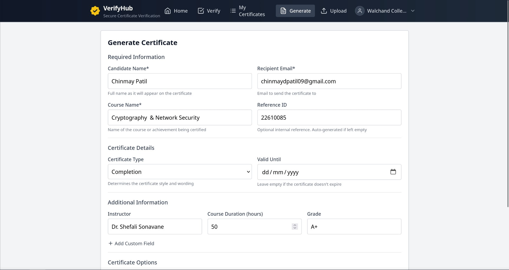
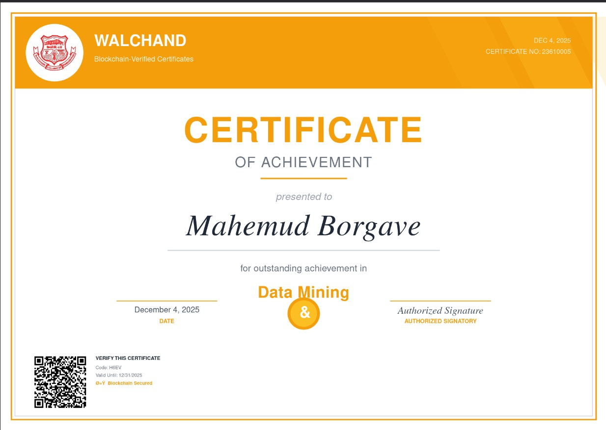
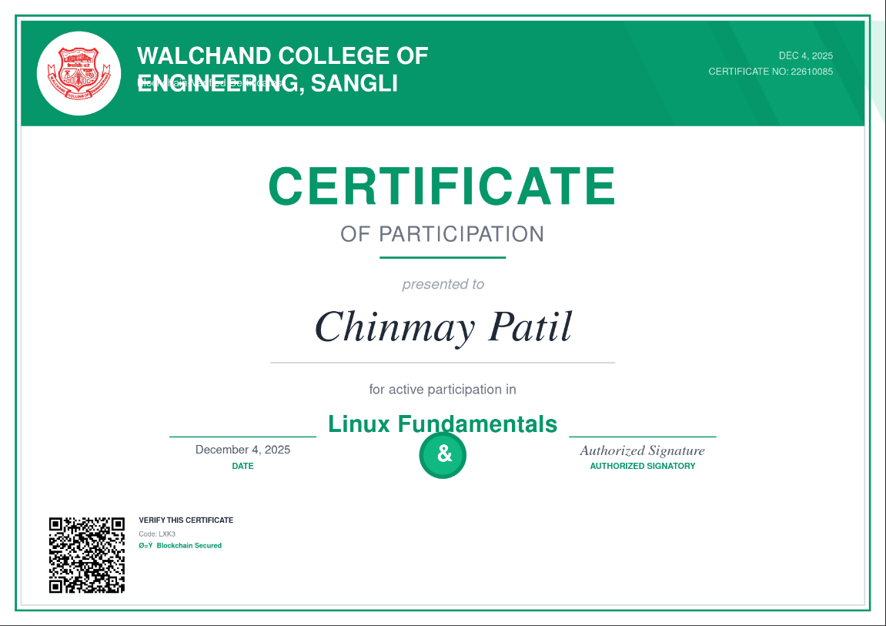
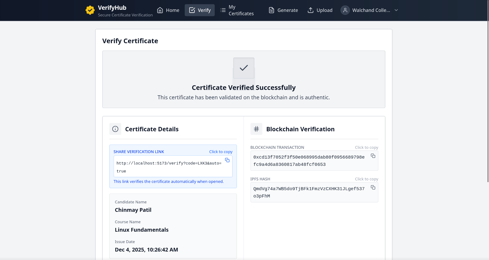
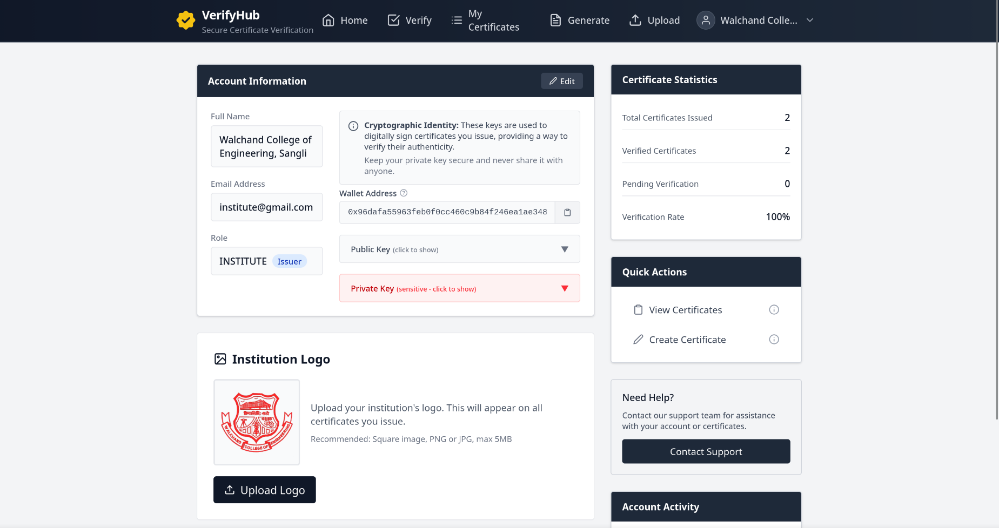

# VerifyHub

A blockchain-based certificate verification platform that enables institutions to issue and verify tamper-proof digital certificates.

## Overview

VerifyHub provides a secure way to issue, store, and verify educational certificates using blockchain technology and IPFS storage. Certificates are cryptographically signed and stored on the Ethereum blockchain, ensuring authenticity and preventing fraud.

## Screenshots

### Certificate Generation


### Certificate Types

**Achievement Certificate**


**Completion Certificate**


**Participation Certificate**


### Certificate Verification


### User Profile


## Features

- Blockchain-secured certificate issuance and verification
- Decentralized storage using IPFS
- Real-time certificate status updates
- Institution branding with custom logos
- Multi-network support (Ganache, Sepolia, Polygon, Ethereum)
- QR code verification
- RESTful API

## Technology Stack

**Backend**
- Node.js with Express
- MongoDB
- Web3.js and Truffle
- Socket.IO
- PDFKit

**Frontend**
- React 19
- Vite
- Tailwind CSS
- Axios

## Project Structure

```
VerifyHub/
├── backend/     # Node.js backend
├── frontend/    # React frontend
└── docs/        # Documentation
```

## Getting Started

### Prerequisites

- Node.js v20 (v20.19.4 recommended, v25+ not supported)
- MongoDB
- Docker and Docker Compose

### Installation

1. Clone the repository

2. Install backend dependencies:
   ```bash
   cd backend
   npm install
   ```

3. Install frontend dependencies:
   ```bash
   cd frontend
   npm install
   ```

4. Configure environment variables:
   ```bash
   cd backend
   cp .env.example .env
   # Edit .env with your configuration
   ```

5. Start Docker services (Ganache and MongoDB):
   ```bash
   cd backend
   docker compose up -d
   ```

6. Compile and deploy smart contracts:

   **Option A: Using local Truffle (recommended)**
   ```bash
   cd backend
   npx truffle compile --config truffle-config.cjs
   npx truffle migrate --network development --config truffle-config.cjs --reset
   ```

   **Option B: Using Docker**
   ```bash
   cd backend
   docker compose --profile deploy up truffle
   ```

7. Start the backend server:
   ```bash
   cd backend
   npm start
   ```

8. Start the frontend:
   ```bash
   cd frontend
   npm run dev
   ```

## Documentation

- [API Documentation](backend/API_DOCUMENTATION.md)
- [Deployment Guide](backend/DEPLOYMENT_GUIDE.md)

## License

MIT License
