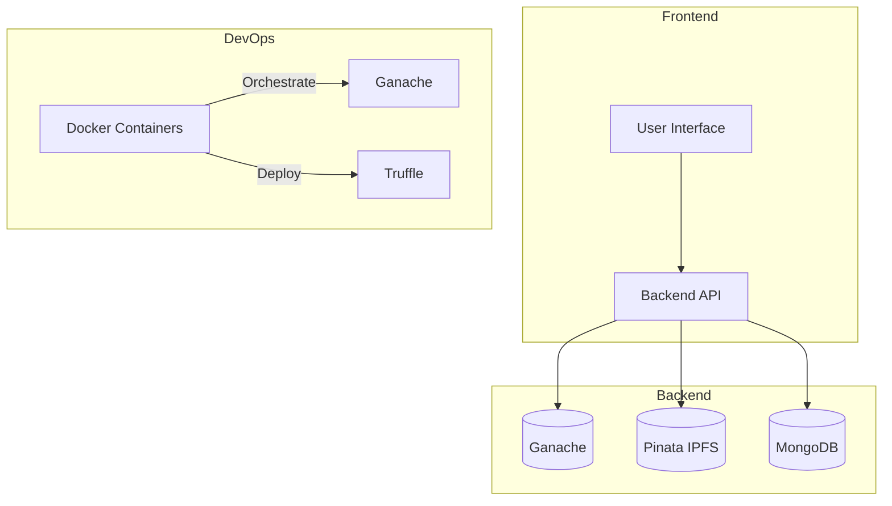
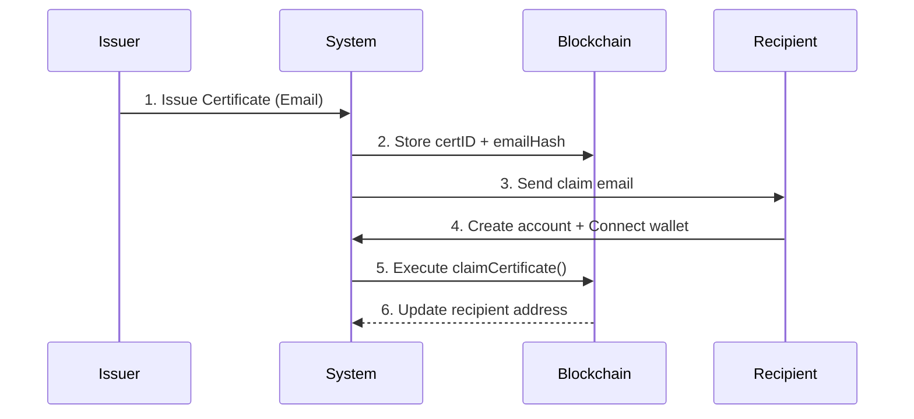
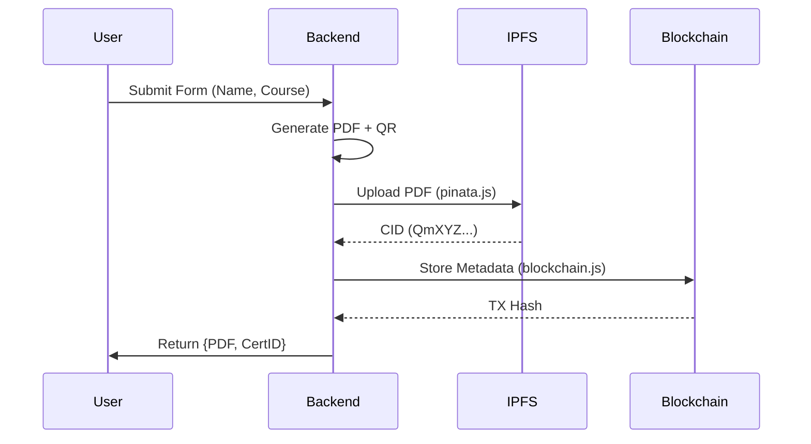

# CertChain: Comprehensive Technical Documentation

**Version:** 2.0.0 | **Last Updated:** [Date]

## Table of Contents

1. [Project Setup](#project-setup)
2. [System Overview](#1-system-overview)
3. [Core Components](#2-core-components)
4. [Implementation Workflows](#3-implementation-workflows)
5. [Technical Challenges & Solutions](#4-technical-challenges--solutions)
6. [Design Decisions](#5-design-decisions)
7. [Deployment Strategy](#6-deployment-strategy)
8. [Future Roadmap](#7-future-roadmap)
9. [Critical Unresolved Issues](#8-critical-unresolved-issues)
10. [Glossary of Terms](#9-glossary-of-terms)
11. [PDF Verification System](#10-pdf-verification-issues-and-solutions)
12. [Certificate Source Management](#11-certificate-source-identification)
13. [Multi-Hash Verification System](#12-multi-hash-verification-system)
14. [Certificate Verification Process](#13-certificate-verification-process)
15. [Email Notification System](#14-email-notification-system)

## Project Setup

```sh
# Install dependencies
npm install

# Start Docker containers
sudo docker compose down -v && sudo docker compose up --build -d

# Start development server
npm run dev -- --host
```

## Smart Contract Deployment

### Prerequisites

- Ganache running (via Docker or local instance)
- Truffle installed globally (`npm install -g truffle`)
- Node.js and npm installed

### Deployment Commands

```sh
# Compile smart contracts
truffle compile --config truffle-config.cjs

# Deploy to development network (Ganache)
truffle migrate --reset --network development --config truffle-config.cjs

# Deploy to specific network
truffle migrate --network <network-name> --config truffle-config.cjs

# Verify contract on Etherscan (if deployed to testnet/mainnet)
truffle run verify Certification --network <network-name> --config truffle-config.cjs
```

### Common Issues & Solutions

1. **Contract Already Deployed**

   ```sh
   # Use --reset flag to force redeployment
   truffle migrate --reset --network development --config truffle-config.cjs
   ```

2. **Network Connection Issues**

   ```sh
   # Check Ganache connection
   curl http://localhost:8545

   # Verify network configuration
   cat truffle-config.cjs
   ```

3. **Gas Limit Errors**
   ```sh
   # Increase gas limit in truffle-config.cjs
   networks: {
     development: {
       gas: 8000000,
       gasPrice: 20000000000
     }
   }
   ```

### Network Configuration

```javascript
// truffle-config.cjs
module.exports = {
  networks: {
    development: {
      host: "127.0.0.1",
      port: 8545,
      network_id: "*",
    },
    testnet: {
      provider: () =>
        new HDWalletProvider(
          process.env.MNEMONIC,
          `https://ropsten.infura.io/v3/${process.env.INFURA_API_KEY}`,
        ),
      network_id: 3,
      gas: 5500000,
      confirmations: 2,
      timeoutBlocks: 200,
      skipDryRun: true,
    },
  },
};
```

## 1. System Overview

### Objective

Immutable certificate management system combining:

- **Blockchain** for tamper-proof records
- **IPFS** for decentralized document storage
- **REST API** for workflow orchestration

### Key Features

- QR-code based instant verification
- Cryptographic proof of authenticity
- Revocation system with expiration
- Multi-gateway IPFS retrieval

### Architecture



## User Roles and DID Management

### User Roles Architecture

1. **Institutes (Issuers)**

   - Each institute gets a dedicated blockchain account
   - Account is used to sign and issue certificates
   - Institute DID is stored in the blockchain
   - Example flow:
     ```mermaid
     sequenceDiagram
         Institute->>Backend: Register Institute
         Backend->>Blockchain: Create Institute Account
         Blockchain-->>Backend: Institute DID
         Backend->>Institute: Return Credentials
     ```

2. **Students (Recipients)**
   - Two types of recipients:
     a. **Registered Users**: Have accounts in the system
     b. **External Recipients**: No system account, only blockchain record
   - Optional MetaMask integration for registered users
   - External recipients identified by email/phone

### DID Implementation Options

1. **Institute DID**

   ```solidity
   // Smart Contract
   struct Institute {
       address wallet;
       string name;
       string did;
       bool isActive;
   }

   mapping(address => Institute) public institutes;
   ```

2. **Student DID (Optional)**
   ```solidity
   // Smart Contract
   struct Student {
       address wallet;  // Optional
       string email;
       string did;
   }
   ```

### Frontend Integration Guide

1. **Institute Registration**

   ```javascript
   // Frontend Flow
   const registerInstitute = async (instituteData) => {
     // 1. Create blockchain account
     const account = await web3.eth.accounts.create();

     // 2. Register with backend
     const response = await api.post("/institutes", {
       ...instituteData,
       wallet: account.address,
     });

     // 3. Store credentials securely
     localStorage.setItem("instituteWallet", account.privateKey);
   };
   ```

2. **Certificate Issuance**

   ```javascript
   // Frontend Flow
   const issueCertificate = async (studentData) => {
     // 1. Generate certificate
     const certificate = await api.post("/certificates", {
       studentData,
       instituteWallet: localStorage.getItem("instituteWallet"),
     });

     // 2. Sign transaction
     const signedTx = await web3.eth.accounts.signTransaction(
       certificate.txData,
       localStorage.getItem("instituteWallet"),
     );

     // 3. Send to blockchain
     await web3.eth.sendSignedTransaction(signedTx.rawTransaction);
   };
   ```

3. **Student Verification (Optional)**

   ```javascript
   // With MetaMask
   const verifyWithMetaMask = async () => {
     // Request account access
     const accounts = await window.ethereum.request({
       method: "eth_requestAccounts",
     });

     // Verify certificate
     const result = await api.post("/verify", {
       certificateId,
       wallet: accounts[0],
     });
   };
   ```

### Implementation Considerations

1. **Security**

   - Institute private keys should be stored securely
   - Consider using hardware wallets for institutes
   - Implement proper key rotation policies

2. **User Experience**

   - Provide clear instructions for MetaMask setup
   - Support both registered and unregistered students
   - Implement fallback verification methods

3. **Scalability**
   - Consider using DID resolvers for large-scale deployments
   - Implement caching for frequently accessed DIDs
   - Use batch operations for bulk certificate issuance

### Future Enhancements

1. **DID Standards**

   - Implement W3C DID standards
   - Add support for multiple DID methods
   - Enable cross-platform DID resolution

2. **Identity Verification**

   - Integrate with identity providers
   - Add KYC/AML compliance
   - Implement multi-factor authentication

3. **Smart Contract Upgrades**
   - Add support for revocable DIDs
   - Implement DID delegation
   - Add support for DID documents

## Alternative Approach: Delayed Recipient Binding

### Overview

This approach allows certificates to be issued with only the recipient's email, and the blockchain record is updated later when the recipient creates an account and connects their wallet.

### Smart Contract Design

```solidity
// contracts/Certification.sol
contract Certification {
    struct Certificate {
        address issuer;
        bytes32 certificateId;
        string emailHash;  // SHA-256 hash of recipient email
        address recipient; // Initially empty, updated later
        bool claimed;
    }

    mapping(bytes32 => Certificate) public certificates;
    mapping(string => bytes32) public emailToCertId;

    function createCertificate(
        bytes32 _certId,
        string memory _emailHash
    ) external {
        certificates[_certId] = Certificate({
            issuer: msg.sender,
            certificateId: _certId,
            emailHash: _emailHash,
            recipient: address(0),
            claimed: false
        });
        emailToCertId[_emailHash] = _certId;
    }

    function claimCertificate(string memory _emailHash) external {
        bytes32 certId = emailToCertId[_emailHash];
        require(!certificates[certId].claimed, "Already claimed");

        certificates[certId].recipient = msg.sender;
        certificates[certId].claimed = true;
    }
}
```

### Workflow



### Implementation Steps

1. **Certificate Issuance**

   - Issuer provides course details and recipient email
   - System generates emailHash = SHA256(email)
   - Certificate is stored on blockchain with empty recipient field

2. **Email Notification**

   - System sends claim email to recipient
   - Email contains unique claim token
   - Token expires after 30 days

3. **Recipient Claim Process**
   - Recipient clicks claim link
   - Connects MetaMask wallet
   - System verifies email ownership
   - Blockchain record is updated with recipient's address

### Database Schema

```javascript
// MongoDB Schema
const PendingCertificate = new Schema({
  certId: { type: String, index: true },
  email: { type: String, index: true },
  claimToken: String,
  expiresAt: Date,
});

const User = new Schema({
  email: { type: String, unique: true },
  walletAddress: { type: String, index: true },
  claimedCerts: [{ type: String }],
});
```

### Security Considerations

1. **Immutable Core Data**

   - Certificate ID, issuer, and email hash cannot be modified
   - Only recipient address field is updatable

2. **Claim Validation**
   - Email verification required
   - One-time claim per certificate
   - Expiration mechanism for unclaimed certificates

### Advantages

1. **Flexible Onboarding**

   - Recipients can claim certificates at their convenience
   - No immediate wallet requirement

2. **Maintains Blockchain Integrity**

   - Core certificate data remains immutable
   - Only recipient address is updatable

3. **Prevents Unauthorized Claims**
   - Email verification required
   - One-time claim mechanism

### Challenges

1. **Additional Steps**

   - Recipients must complete claim process
   - Email verification system required

2. **Gas Costs**

   - Additional transaction for claiming
   - Need to handle unclaimed certificates

3. **Implementation Complexity**
   - Email verification system
   - Claim token management
   - Expiration handling

### Recommended Implementation Order

1. Basic email hash storage in contract
2. Claim email system with tokens
3. Wallet connection UI
4. Certificate claim endpoint
5. Dashboard for tracking unclaimed certificates
6. Automatic expiry cleanup

## 2. Core Components

### A. Smart Contracts

**File:** `contracts/Certification.sol`  
**Key Functions:**

```solidity
// 1. Certificate Creation
function createCertificate(
    bytes32 _certId,
    address _student,
    string memory _course
) external onlyIssuer { ... }

// 2. Revocation
function revokeCertificate(bytes32 _certId) external { ... }
```

### B. Backend Services

**Structure:**

```
src/
├── controllers/         # Business logic
├── models/              # Database schemas
├── utils/               # Blockchain/IPFS handlers
└── routes/              # API endpoints
```

#### Critical Files:

1. **Certificate Controller** (`certificate.controller.js`)

   - `generateCertificate()`: Orchestrates PDF→IPFS→Blockchain flow
   - `verifyCertificatePdf()`: Compares PDF hash with blockchain

2. **Blockchain Utility** (`utils/blockchain.js`)
   - Manages Web3 connection lifecycle
   - Handles contract initialization with retries

### C. Data Models

**MongoDB Schemas:**

```javascript
// certificate.model.js
const CertificateSchema = new Schema({
  certificateId: { type: String, index: true },
  ipfsHash: String,
  issuerAddress: String,
  revoked: { type: Boolean, default: false },
});
```

## 3. Implementation Workflows

### A. Certificate Generation



### B. Verification Process

1. **QR Scan** → Extract `certificateId`
2. **Blockchain Check**
   ```javascript
   // verification.controller.js
   const isRevoked = await contract.methods.isRevoked(certId).call();
   ```
3. **IPFS Validation**
   ```javascript
   const pdf = await axios.get(`${PINATA_GATEWAY}/${cert.ipfsHash}`);
   ```

### C. Authentication Flow

**File:** `auth.controller.js`

```javascript
// Hybrid Auth System
if (req.body.wallet) {
  // Verify Ethereum signature
} else {
  // Email/password fallback
}
```

## 4. Technical Challenges & Solutions

### A. PDF Hash Consistency

**Problem:** Same content → Different hash due to metadata changes  
**Solution:**

```javascript
// pdfHashUtils.js
export const computeStableHash = (buffer) => {
  // Remove metadata before hashing
  const cleaned = removePdfMetadata(buffer);
  return sha256(cleaned);
};
```

### B. Docker Deployment Race Conditions

**Issue:** Truffle migrates before Ganache is ready  
**Fix:** `wait-for-it.sh` in `docker-compose.yml`

```yaml
services:
  truffle:
    command: ["./wait-for-it.sh", "ganache:8545", "--", "truffle", "migrate"]
```

### C. Blockchain Connection Drops

**Recovery Mechanism:**

```javascript
// blockchain.js
export const getContract = () => {
  if (!contract) throw new Error("Reinitializing...");
  return contract;
};
```

## 5. Design Decisions

### A. Optional Student Wallets

**Why:**

- Avoid user friction for non-crypto audiences
- Allow progressive adoption path
- Support institutional use cases

**Implementation:**

```javascript
// certificate.model.js
studentWallet: { type: String, required: false }
```

### B. Ganache over Mainnet

**Rationale:**

- Zero gas costs during development
- Instant transaction finality
- Pre-funded test accounts

### C. Pinata over Self-Hosted IPFS

**Advantages:**

- Managed pinning service
- Dedicated gateway with CDN
- Monitoring dashboard

## 6. Deployment Strategy

### Current Setup

```bash
# Infrastructure
docker-compose up -d ganache redis mongo
npm run migrate:contracts
npm start
```

### Known Issues

1. **Persistent Storage:** Ganache state reset on container restart
2. **IPFS Costs:** Pinata free tier limitations
3. **Security:** JWT secrets in environment variables

### Solutions in Progress

1. Ganache volume mounts for chain data
2. IPFS cluster setup with fallback gateways
3. Hashicorp Vault integration

## 7. Future Roadmap

### Short-Term (Q3 2024)

- Multi-file certificate support
- Batch issuance transactions
- Gas price optimization

### Mid-Term (Q4 2024)

- W3C Verifiable Credentials compliance
- Polygon/Mumbai testnet deployment
- Zero-Knowledge proof integration

### Long-Term (2025)

- Cross-chain revocation registry
- DAO-based governance model
- AI-powered fraud detection

## 8. Critical Unresolved Issues

| File                 | Issue                  | Severity |
| -------------------- | ---------------------- | -------- |
| `pdfReaderUtils.js`  | Malformed PDF handling | High     |
| `Dockerfile.truffle` | Build cache bloat      | Medium   |
| `auth.middleware.js` | JWT revocation missing | Critical |

## 9. Glossary of Terms

- **CID (Content Identifier):** IPFS file hash starting with `Qm...`
- **Ganache:** Local Ethereum blockchain for development
- **Truffle:** Smart contract deployment framework
- **Merkle Proof:** Efficient certificate revocation check (Future)

## 10. PDF Verification Issues and Solutions

### **Problem: PDF Hash Verification Mismatch**

**Issue:** When verifying certificates by uploading PDFs, the system was failing to match the uploaded PDF with certificates in the database. This was happening because:

1. The system was computing a SHA-256 hash of the PDF content, but certificates in the database were stored with IPFS CIDs (starting with "Qm" or "bafkrei").
2. The verification process was trying to use the computed hash directly without considering the different hash formats.
3. The CID generation method was incorrect, leading to mismatches between locally computed CIDs and those stored in IPFS.

### **Solution: Enhanced Hash Comparison**

We implemented a more robust verification approach:

1. **Multiple Hash Storage**: The Certificate model now stores three types of hashes:

   - `ipfsHash`: The hash returned by Pinata when uploading to IPFS
   - `sha256Hash`: The SHA-256 hash computed from the PDF content
   - `cidHash`: The IPFS CID computed from the PDF content

   ```javascript
   // certificate.model.js
   const CertificateSchema = new mongoose.Schema({
     // ... existing fields
     ipfsHash: { type: String, required: true },
     sha256Hash: { type: String }, // Add SHA-256 hash field
     cidHash: { type: String }, // Add CID hash field
     // ... other fields
   });
   ```

2. **Correct CID Generation**: The `computePDFHash` function now uses the correct method to generate IPFS CIDs:

   ```javascript
   // pdfHashUtils.js
   export const computePDFHash = async (pdfBuffer) => {
     // Compute SHA-256 hash
     const sha256Hash = crypto
       .createHash("sha256")
       .update(pdfBuffer)
       .digest("hex");

     // Compute IPFS-compatible CID using the correct method
     // Pinata uses CIDv0 format which is a base58btc encoded multihash
     const bytes = await sha256.digest(pdfBuffer);
     const cid = CID.createV0(bytes);
     const cidHash = cid.toString();

     return { sha256Hash, cidHash };
   };
   ```

3. **Multi-Format Verification**: The verification process now checks for matches using all three hash formats:

   ```javascript
   // Try to find certificate in database by SHA-256 hash
   let certificate = await Certificate.findOne({ sha256Hash: sha256Hash });
   let matchType = "exact_sha256";

   // If not found by SHA-256, try to find by CID hash
   if (!certificate && cidHash) {
     certificate = await Certificate.findOne({ cidHash: cidHash });
     if (certificate) {
       matchType = "exact_cid";
     }
   }

   // If still not found, try to find by IPFS hash
   if (!certificate) {
     certificate = await Certificate.findOne({ ipfsHash: sha256Hash });
     if (certificate) {
       matchType = "exact_ipfs";
     }
   }
   ```

4. **Partial Hash Matching**: As a fallback, the system also checks for partial matches between the computed hash and stored hashes:

   ```javascript
   // Check if the computed hash is contained in any of the certificate's hash fields
   if (
     cert.sha256Hash &&
     (cert.sha256Hash.includes(sha256Hash) ||
       sha256Hash.includes(cert.sha256Hash))
   ) {
     // Match found with SHA-256 hash
   }

   if (
     cert.cidHash &&
     cidHash &&
     (cert.cidHash.includes(cidHash) || cidHash.includes(cert.cidHash))
   ) {
     // Match found with CID hash
   }

   if (
     cert.ipfsHash &&
     (cert.ipfsHash.includes(sha256Hash) || sha256Hash.includes(cert.ipfsHash))
   ) {
     // Match found with IPFS hash
   }
   ```

5. **Certificate Source Tracking**: We've added a `source` field to the Certificate model to distinguish between internally generated certificates and external ones:

   ```javascript
   // certificate.model.js
   const CertificateSchema = new Schema({
     // ... existing fields
     source: {
       type: String,
       enum: ["internal", "external"],
       default: "internal",
     },
   });
   ```

### **Key Insights**

1. **Hash Format Consistency**: It's crucial to ensure that the hash format used during verification matches the format used when storing certificates. In our case, we needed to support multiple hash formats.

2. **Direct Hash Comparison**: Instead of parsing PDF content or extracting metadata, we're now focusing on direct hash comparison, which is more reliable and efficient.

3. **Debugging Tools**: We've added a debug endpoint (`/api/certificates/debug/pdf`) that provides detailed information about the uploaded PDF, computed hashes, and database matches, making it easier to diagnose verification issues.

### **Future Improvements**

1. **Hash Format Standardization**: Consider standardizing on a single hash format (either SHA-256 or CID) to simplify the verification process.

2. **Hash Preprocessing**: Implement preprocessing steps to normalize PDFs before hashing, ensuring that minor formatting changes don't affect the hash.

3. **Blockchain Integration**: Enhance the blockchain search to support both hash formats and improve the efficiency of certificate lookups.

## 11. Certificate Source Identification

### **Problem: Distinguishing Between Internal and External Certificates**

**Issue:** The system needs to handle both certificates generated by our platform and those uploaded from external sources. This distinction is important for:

1. Applying the correct verification logic
2. Providing appropriate user feedback
3. Maintaining data integrity

### **Solution: Certificate Source Tracking**

We've implemented a source tracking mechanism:

1. **Certificate Source Flag**: Added a `source` field to the certificate model:

   ```javascript
   // certificate.model.js
   const CertificateSchema = new Schema({
     // ... existing fields
     source: {
       type: String,
       enum: ["internal", "external"],
       default: "internal",
     },
   });
   ```

2. **Source-Specific Verification**: The verification process now considers the certificate source:

   ```javascript
   // For internal certificates, we can use metadata-based verification
   if (certificate.source === "internal") {
     // Use metadata extraction for verification
   } else {
     // For external certificates, rely solely on hash comparison
   }
   ```

3. **Upload Endpoint Enhancement**: The certificate upload endpoint now sets the source field:

   ```javascript
   // For certificates generated by our platform
   const newCertificate = await Certificate.create({
     // ... other fields
     source: "internal",
   });

   // For externally uploaded certificates
   const externalCertificate = await Certificate.create({
     // ... other fields
     source: "external",
   });
   ```

### **Benefits**

1. **Flexible Verification**: The system can now apply different verification strategies based on the certificate source.

2. **Improved User Experience**: Users receive more accurate feedback about their certificates.

3. **Data Integrity**: The system maintains a clear record of which certificates were generated internally versus externally.

### **Future Enhancements**

1. **Source-Specific Metadata**: Consider storing additional metadata specific to each source type.

2. **Verification Confidence Levels**: Implement a confidence score for verification results, with higher scores for internally generated certificates.

3. **Source Migration**: Add functionality to convert external certificates to internal ones if they meet certain criteria.

## 12. Multi-Hash Verification System

### **Problem: Hash Format Inconsistency**

When working with IPFS and PDF verification, we encountered several challenges:

1. **Different Hash Formats**:

   - SHA-256: Direct hash of the PDF content
   - IPFS CID: Content identifier used by IPFS
   - Pinata CID: Slightly different CID format used by Pinata

2. **Hash Generation Differences**:
   - Our local CID computation might differ from Pinata's
   - Different IPFS implementations might generate different CIDs
   - PDF metadata or formatting changes can affect hashes

### **Solution: Multi-Hash Storage and Verification**

We implemented a robust verification system that:

1. **Stores Multiple Hash Formats**:

   ```javascript
   // certificate.model.js
   const CertificateSchema = new Schema({
     // ... other fields
     sha256Hash: String, // Direct file hash
     cidHash: String, // Our computed CID
     ipfsHash: String, // Pinata's CID
   });
   ```

2. **Computes All Hash Formats**:

   ```javascript
   // certificateUtils.js
   export const computePDFHashes = async (pdfBuffer) => {
     // SHA-256 hash
     const sha256Hash = crypto
       .createHash("sha256")
       .update(pdfBuffer)
       .digest("hex");

     // IPFS CID
     const bytes = await sha256.digest(pdfBuffer);
     const cid = CID.createV0(bytes);
     const cidHash = cid.toString();

     return { sha256Hash, cidHash };
   };
   ```

3. **Handles IPFS Upload**:

   ```javascript
   export const uploadToIPFS = async (pdfBuffer, filename) => {
     // Get our computed hashes
     const { sha256Hash, cidHash } = await computePDFHashes(pdfBuffer);

     // Upload to Pinata and get their CID
     const ipfsHash = await pinata.uploadBufferToPinata(pdfBuffer, filename);

     return { sha256Hash, cidHash, ipfsHash };
   };
   ```

4. **Flexible Verification**:
   ```javascript
   export const findCertificateByAnyHash = async (hash) => {
     return await Certificate.findOne({
       $or: [
         { sha256Hash: hash },
         { cidHash: hash },
         { ipfsHash: hash },
         { certificateId: hash },
       ],
     });
   };
   ```

### **How It Works**

1. **Upload Process**:

   - When a PDF is uploaded, we compute both SHA-256 and CID hashes
   - Upload to Pinata and get their CID
   - Store all three hashes in the database
   - Store Pinata's CID on the blockchain

2. **Verification Process**:

   - Accept any hash format (SHA-256, CID, or certificate ID)
   - Check all stored hash fields for a match
   - Return the certificate if any hash matches

3. **Example Response**:
   ```json
   {
     "status": "VALID",
     "certificate": {
       "certificateId": "3eb3b981b1381cbcf17f4aeb695b75e0c0c8dcd09e1a36cfdd3f55ee2bb63975",
       "candidateName": "WCE",
       "courseName": "External Certificate",
       "orgName": "Raghav"
     },
     "hashes": {
       "sha256Hash": "605d8ba17f11884b6e0e372724f9f3d040f3d4493d33769e80c538d887ead058",
       "cidHash": "QmUppadKPpcj9t1epPLDWYeKhMEBNncFpMQavnFV2juzum",
       "ipfsHash": "QmZHCzRfu6fnHCVkPLt6JDvAgxDj3FRZ9fxs4pPEfmGrhY"
     }
   }
   ```

### **Benefits**

1. **Flexibility**: Users can verify certificates using any hash format
2. **Reliability**: Multiple hash formats increase the chances of successful verification
3. **Transparency**: All hash formats are stored and returned in the response
4. **Debugging**: Easy to identify which hash format matched during verification

### **Future Improvements**

1. **Hash Normalization**: Implement preprocessing to ensure consistent hash generation
2. **Hash Migration**: Add tools to update old certificates with new hash formats
3. **Hash Validation**: Add validation to ensure stored hashes are in correct format
4. **Performance Optimization**: Add indexes for hash fields to improve search speed

## 13. Certificate Verification Process

### Certificate Status Lifecycle

The system implements a state-based certificate verification process:

1. **PENDING** → Initial state when certificate is generated
2. **CONFIRMED** → Certificate verified on blockchain
3. **FAILED** → Certificate verification timeout (15+ minutes in PENDING)

### Blockchain Polling Mechanism

The system uses a polling mechanism to verify certificates on the blockchain:

- **Why Polling?**

  - More reliable than event subscriptions across different blockchain providers
  - Works with any Ethereum-compatible blockchain
  - Handles network interruptions gracefully
  - Ensures no certificates are missed due to event subscription failures

- **Polling Schedule:**

  - Every 30 seconds for blockchain status checks
  - Every 30 seconds for quick certificate checks (first 10 minutes)
  - Every 1 minute for comprehensive verification

- **Verification Methods:**
  - Transaction receipt verification (fastest)
  - Smart contract method calls (multiple fallbacks)
  - Smart contract event monitoring (optional)

### Implementation Details

```javascript
// blockchain.js
const interval = setInterval(async () => {
  try {
    const count = await checkAndUpdateCertificates(Certificate);
    console.log(
      `Periodic check complete: ${count.updated} certificates updated`,
    );
  } catch (err) {
    console.error("Error in periodic certificate check:", err.message);
  }
}, 30 * 1000); // Every 30 seconds
```

### Recovery and Resilience

- Automatic recovery from blockchain connection issues
- Status preserved across system restarts
- Database as source of truth for certificate status
- Graceful handling of contract method failures

## 14. Email Notification System

### Automatic Email Notifications

The system automatically sends email notifications when certificates are verified on the blockchain:

- **Notification Triggers:**

  1. When certificate transitions from PENDING to CONFIRMED
  2. When system detects CONFIRMED certificates without sent emails
  3. On system startup for any missing notifications

- **Email Content:**
  - Personalized greeting with recipient name
  - Certificate details (course, institution, dates)
  - Direct link to view/download certificate PDF
  - Verification link to validate authenticity
  - QR code for mobile verification

### Email Status Tracking

Every certificate tracks its email notification status:

```javascript
// Certificate model
{
  // ... other certificate fields
  emailSent: Boolean,       // Whether email has been sent
  emailSentAt: Date,        // When email was sent
  recipientEmail: String,   // Email recipient
}
```

### Email Sending Process

```javascript
// Dedicated function for email processing
export const sendEmailsForConfirmedCertificates = async () => {
  try {
    // Find all CONFIRMED certificates without emails sent
    const confirmedCertificates = await Certificate.find({
      status: "CONFIRMED",
      emailSent: { $ne: true },
      recipientEmail: { $exists: true, $ne: null },
    });

    // Send emails and track results
    const emailResults = await sendConfirmedCertificateEmails(
      confirmedCertificates,
    );

    // Update database with email status
    for (const cert of confirmedCertificates) {
      if (
        emailResults.details.find(
          (detail) =>
            detail.certificateId === cert.certificateId &&
            detail.status === "sent",
        )
      ) {
        await Certificate.updateOne(
          { _id: cert._id },
          { $set: { emailSent: true, emailSentAt: new Date() } },
        );
      }
    }

    return {
      sent: emailResults.sent,
      failed: emailResults.failed,
      skipped: emailResults.skipped,
    };
  } catch (error) {
    console.error("Error sending emails:", error);
    return { sent: 0, failed: 0, error: error.message };
  }
};
```

### Configuration

Email settings are configured via environment variables:

```
# Email Configuration
EMAIL_HOST=smtp.gmail.com
EMAIL_PORT=587
EMAIL_USER=your-email@gmail.com
EMAIL_PASSWORD=your-app-password
EMAIL_FROM=Your Name <your-email@gmail.com>
```
